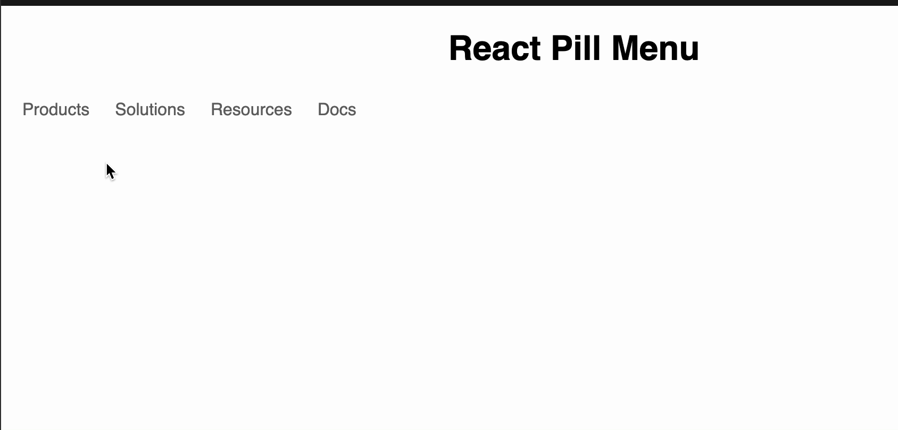

# React-Pill-Menu

A pill effect nav menus react component

## how to use it

````bash
yarn install react-pill-menu

```tsx
import { PillMenu, PillMenuItem } from 'react-pill-menu'
// style
import 'react-pill-menu/dist/style.css'

export function MyNavMenu() {
  return (
    <PillMenu>
      <PillMenuItem>
        <a href="/products">Products</a>
      </PillMenuItem>
      <PillMenuItem>
        <a href="/solutions">Solutions</a>
      </PillMenuItem>
      <PillMenuItem>
        <a href="/resources">Resources</a>
      </PillMenuItem>
      <PillMenuItem>
        <a href="/docs">Docs</a>
      </PillMenuItem>
    </PillMenu>
  )
}
````

## demo



## check a example

[example](https://codesandbox.io/p/sandbox/react-pill-menu-czsnkh?file=%2Fsrc%2FApp.tsx%3A6%2C11)
